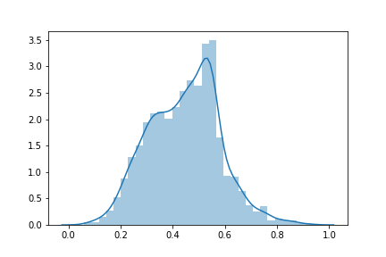

Reimplementing [A Novel Chaos Theory Inspired Neuronal Architecture"](https://arxiv.org/pdf/1905.12601.pdf).   

Haven't implemented the small training set regime yet, just focusing on standard cross-validation.   
So far the best result I've got the best result with macro averaged F1-score of 0.93 averaged over 10-folds of crossval 
with ```q = 0.59``` and ```b = 0.9```.   


There is a large variance in performance when searching through ```q``` and ```b```.    
Below the plot shows the distribution of average F1-scores with 10-fold cross-validation on Iris.   
The mean performance is around 0.6 and getting the best 0.93 is very lucky.




This performance can be improved to 0.96 using 80-bit floating points and performance drops to 0.88 
with 32-bit representaton.
